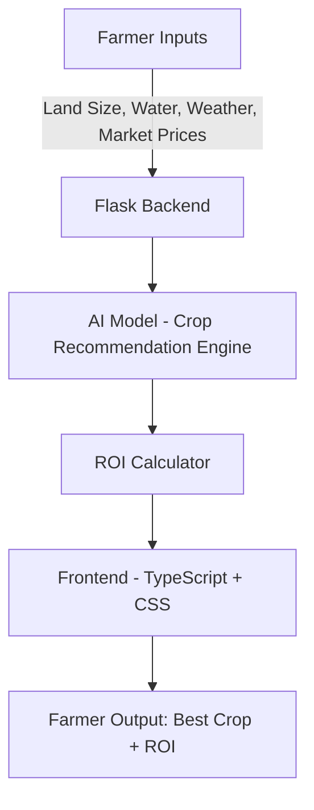

# 🌾 FarmAiHelp – AI Crop Planner for Indian Farmers  

## 📖 Introduction  
**FarmAiHelp** is an **AI-powered decision-support system** designed to empower **Indian farmers** with actionable insights for crop planning.  

Every farming season, farmers face a **critical decision**: which crop to plant. Choosing the wrong crop can lead to **low yields, wasted resources, and financial losses**. FarmAiHelp tackles this challenge by combining **agricultural knowledge, market intelligence, and AI** to recommend the **most suitable crop** for a farmer’s unique conditions.  

By analyzing factors such as:  
- 🌍 **Land size**  
- 💧 **Water availability**  
- 🌦️ **Local weather patterns**  
- 📊 **Current market prices**  

FarmAiHelp suggests the **best crop to cultivate** and provides an **estimated return on investment (ROI)**, enabling farmers to maximize profit while using resources sustainably.  

---

## 🎯 Project Goals  
- ✅ **Support Indian farmers** with AI-driven, accessible tools.  
- ✅ **Optimize agricultural decision-making** based on local conditions.  
- ✅ **Improve farmer incomes** through better ROI forecasting.  
- ✅ **Promote sustainability** by matching crop choices with water and climate realities.  
- ✅ **Bridge the technology gap** with a user-friendly web-based platform.  

---

## 📑 Table of Contents  
- [Introduction](#-introduction)  
- [Project Goals](#-project-goals)  
- [Features](#-features)  
- [System Architecture](#-system-architecture)  
- [Tech Stack](#-tech-stack)  
- [Installation](#-installation)  
- [Usage](#-usage)  
- [Configuration](#-configuration)  
- [Example Workflow](#-example-workflow)  
- [Future Enhancements](#-future-enhancements)  
- [Troubleshooting](#-troubleshooting)  
- [Contributors](#-contributors)  
- [License](#-license)  

---

## ✨ Features  
- 📊 **AI-Powered Crop Recommendations** – Personalized crop suggestions tailored to farmer inputs.  
- 🌦️ **Weather-Aware Planning** – Accounts for seasonal climate and rainfall patterns.  
- 💧 **Resource Optimization** – Matches crops with available water and land size.  
- 💹 **ROI Estimation** – Provides projected financial outcomes for informed decision-making.  
- 🌍 **Localized Insights** – Focused on Indian agriculture and market dynamics.  
- 💻 **Web-Based Interface** – Simple, intuitive, and accessible to all farmers.  

---

## 🏗 System Architecture  



- **Farmer Inputs**: Land size, water availability, local weather, market prices.  
- **Backend (Flask)**: Handles data preprocessing, model execution, and API endpoints.  
- **AI Model**: Predicts suitable crops based on input parameters.  
- **ROI Calculator**: Estimates financial returns.  
- **Frontend (TypeScript + CSS)**: Displays results in an accessible web UI.  

---

## 🛠 Tech Stack  
- **Backend**: Python, Flask  
- **Frontend**: TypeScript, CSS  
- **AI/ML Models**: Python-based recommendation system  
- **Deployment**: Web service (local or cloud-hosted)  

---

## ⚙️ Installation  

### 1. Clone the repository  
```bash
git clone https://github.com/AakashMutum/Team-Obsidian---FarmAiHelp.git
cd Team-Obsidian---FarmAiHelp
```

### 2. Create & activate a virtual environment  
```bash
python -m venv venv
source venv/bin/activate   # Linux/Mac
venv\Scripts\activate      # Windows
```

### 3. Install dependencies  
```bash
pip install -r requirements.txt
```

### 4. Run the Flask server  
```bash
python app.py
```

The app will start at: `http://127.0.0.1:5000/`  

---

## 🚀 Usage  

1. Open the web app in your browser.  
2. Enter required details:  
   - Land size (in acres/hectares)  
   - Water availability (low, medium, high)  
   - Weather conditions (season, rainfall)  
   - Current market prices  
3. Click **Get Recommendation**.  
4. View results:  
   - ✅ Suggested crop  
   - ✅ Estimated ROI  

---

## 🔧 Configuration  
- **Weather Data**: Connect to APIs (e.g., IMD, OpenWeather) for real-time forecasts.  
- **Market Prices**: Integrate with government databases or update manually.  
- **Model Updates**: Retrain periodically with fresh agricultural datasets for improved accuracy.  

---

## 📊 Example Workflow  

**Inputs:**  
- Land: 5 acres  
- Water: Medium availability  
- Season: Monsoon  
- Prices: Paddy ₹18/kg, Maize ₹14/kg, Pulses ₹55/kg  

**Output:**  
- Recommended Crop: **Paddy** 🌾  
- Estimated ROI: **₹60,000 per season**  

---

## 🚀 Future Enhancements  
- 🔄 **Multi-crop Planning** – Suggest crop rotation for better soil health.  
- 📡 **IoT Sensor Integration** – Use real-time soil and weather sensors.  
- 🗣 **Regional Language Support** – Voice/text-based interaction in Indian languages.  
- ☁️ **Cloud Deployment** – Scalable solution for nationwide adoption.  
- 📈 **Market Forecasting** – Predict future crop demand and prices.  

---

## 🛠 Troubleshooting  
- ❌ **Flask server not starting?**  
  - Check Python version (≥3.8)  
  - Ensure Flask is installed  

- ❌ **Model not loading?**  
  - Confirm model files exist in `/models` folder  

- ❌ **Frontend not displaying results?**  
  - Check browser console for API errors  
  - Verify backend is running  

---

## 👥 Contributors  
This project was developed by **Team Obsidian**:  

- [aakashmutum](https://github.com/aakashmutum)  
- [midnyghtsky](https://github.com/midnyghtsky)  
- [lavanyagupta1711](https://github.com/lavanyagupta1711)  
- [NIkhith-Pelluri](https://github.com/NIkhith-Pelluri)    

---

## 📜 License  
This project currently does not include a license.  
By default, all rights are reserved by the authors.  

